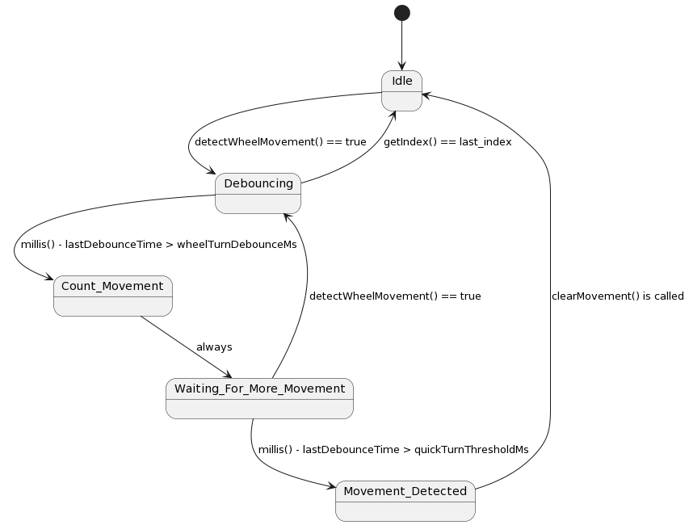

[Full Readme](README.md)

### Movement State Machine (FSM)

### States and Transitions

#### 1. Idle
- **Description**: The system's default state when no movement is detected. It waits for user interaction.
- **Entry Actions**: Reset `movement_count`, save the current wheel number as `last_wheel_number`, and capture the current index position as `last_index` to prepare for detecting new movements.
- **Exit Actions**: None.
- **Transitions**:
  - **To Debouncing**: Triggered when `detectWheelMovement()` returns `true`, indicating potential wheel movement. This transition signifies the start of movement detection.

#### 2. Debouncing
- **Description**: Filters out false positives in movement detection, ensuring that only intentional movements are considered.
- **Entry Actions**: Update `lastDebounceTime` to the current time to start the debounce timing.
- **Exit Actions**: None.
- **Transitions**:
  - **To Count_Movement**: Occurs when the elapsed time since `lastDebounceTime` exceeds `wheelTurnDebounceMs`, suggesting a legitimate movement.
  - **Back to Idle**: If `getIndex()` matches `last_index`, indicating no change in position, the action updates `lastDebounceTime` and resets to the Idle state, filtering out noise or unintended movements.

#### 3. Count_Movement
- **Description**: Confirms and counts the wheel movement, moving towards determining if the movement aligns with expected user interaction.
- **Entry Actions**: Increment `movement_count` to track the number of detected movements.
- **Exit Actions**: None.
- **Transitions**:
  - **To Waiting_For_More_Movement**: Automatically transitions after action completion, awaiting further movements or the confirmation of movement cessation.

#### 4. Waiting_For_More_Movement
- **Description**: A buffer state allowing for the detection of additional movements within a short timeframe, distinguishing between single and multiple adjustments.
- **Entry Actions**: Reset `lastDebounceTime` and update `last_index` to the current index, preparing to detect further movement.
- **Exit Actions**: None.
- **Transitions**:
  - **To Movement_Detected**: If the elapsed time since `lastDebounceTime` exceeds `quickTurnThresholdMs`, confirming movement detection.
  - **Back to Debouncing**: Triggered by `detectWheelMovement()` returning `true` again, indicating ongoing wheel movement and necessitating a return to the Debouncing state to handle continuous interaction.

#### 5. Movement_Detected
- **Description**: Final confirmation of wheel movement, indicating a successful user interaction with the pillbox.
- **Entry Actions**: Perform actions such as emitting a beep sequence to signal movement detection, and potentially updating the system's understanding of the current pill slot.
- **Exit Actions**: Clears `movement_count` and resets the system to the Idle state, readying it for the next interaction.
- **Transitions**:
  - **Back to Idle**: Occurs when `clearMovement()` is called, signifying the end of the current movement detection cycle and resetting the machine to await new interactions.

### Initial State
- **Idle**: The machine initializes in the Idle state, awaiting the first user interaction to begin the detection and handling process.

### Implementation Note
This state machine is crucial for ensuring the pillbox operates reliably, accurately tracking user interactions to maintain an up-to-date medication schedule. It effectively filters out accidental or irrelevant movements, focusing on intentional user actions to adjust the medication reminder timings. Through this mechanism, the Physical-Med-Reminder system provides a user-friendly and intuitive interface that requires minimal direct interaction, simplifying daily medication management.