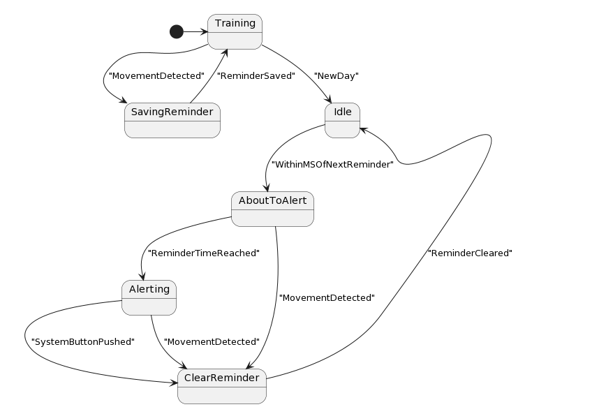

[Full Readme](README.md)

### Movement State Machine (FSM)

### States and Transitions

#### 1. Bootup
Initializes the system and prepares for operation.  

 - **⬅ Reboot(`RebootStarted`): ⬅** Restarts the system, moving from the reboot phase back to the initial operational state..

 - **➡ GatherReminders(`BootupComplete`): ➡** Initializes the recording of the current time slice immediately after system startup.
#### 2. ReminderTimesSet
Captures the current time as a reference point for tracking.  

#### 3. GatherReminders
Awaits the time for the first medication reminder.  

 - **⬅ Bootup(`BootupComplete`): ⬅** Initializes the recording of the current time slice immediately after system startup.

 - **➡ Idle(`RemindersSet`): ➡** Waits for the first medication reminder after the initial setup is completed..
#### 4. Idle
The system is in a standby mode, waiting for interaction or the next event.  

 - **⬅ SetExpectedReminder(`ExpectedReminderSet`): ⬅** Re-enters idle state with the expected reminder time updated and confirmed by the user..
 - **⬅ GatherReminders(`RemindersSet`): ⬅** Waits for the first medication reminder after the initial setup is completed..
 - **⬅ SetExpectedReminder(`ExpectedReminderSet`): ⬅** Transitions to idle after the user has set and confirmed the expected time for the next reminder..
 - **⬅ AdvanceCurrentReminder(`CurrentReminderAdvanced`): ⬅** Resumes idle state after the current medication reminder has been successfully advanced..
 - **⬅ MovementDetected(`MovementHandled`): ⬅** Completes processing of movement and awaits further user interaction..
 - **⬅ DebounceMovement(`DebounceFailed`): ⬅** Returns to idle on failing to validate the wheel movement (debouncing)..

 - **➡ DebounceMovement(`WheelMoved`): ➡** Filters out false wheel movements to prevent erroneous operations..
 - **➡ WaitForCommands(`MainInputClick`): ➡** Enters command waiting state in response to user interaction via main input..
#### 5. DebounceMovement
Filters out false movements to ensure accurate detection.  

 - **⬅ Idle(`WheelMoved`): ⬅** Filters out false wheel movements to prevent erroneous operations..

 - **➡ CountMovement(`DebouncePassed`): ➡** Counts validated wheel movement towards medication adherence tracking..
 - **➡ Idle(`DebounceFailed`): ➡** Returns to idle on failing to validate the wheel movement (debouncing)..
#### 6. CountMovement
Counts valid movement events for processing.  

 - **⬅ DebounceMovement(`DebouncePassed`): ⬅** Counts validated wheel movement towards medication adherence tracking..
 - **⬅ WaitForMoreMovement(`WheelMoved`): ⬅** Increments movement count upon further detected wheel movements..

 - **➡ WaitForMoreMovement(`MovementCounted`): ➡** Monitors for additional wheel movement to confirm continuous user interaction..
#### 7. WaitForMoreMovement
Awaits additional movement to confirm or complete an action.  

 - **⬅ CountMovement(`MovementCounted`): ⬅** Monitors for additional wheel movement to confirm continuous user interaction..

 - **➡ CountMovement(`WheelMoved`): ➡** Increments movement count upon further detected wheel movements..
 - **➡ MovementDetected(`WheelNotMoved`): ➡** Finalizes the movement count if no additional wheel activity is detected..
#### 8. MovementDetected
Detects confirmed movement, signaling a completed interaction.  

 - **⬅ WaitForMoreMovement(`WheelNotMoved`): ⬅** Finalizes the movement count if no additional wheel activity is detected..

 - **➡ Idle(`MovementHandled`): ➡** Completes processing of movement and awaits further user interaction..
#### 9. WaitForCommands
Enters a mode waiting for user commands through the main interface.  

 - **⬅ Idle(`MainInputClick`): ⬅** Enters command waiting state in response to user interaction via main input..

 - **➡ SetExpectedReminder(`MainInputDoubleClick`): ➡** Allows the user to set a new medication reminder through double-clicking..
 - **➡ AdvanceCurrentReminder(`MainInputClick`): ➡** Updates the current medication reminder schedule upon user request..
 - **➡ Reboot(`MainInputHold`): ➡** Triggers a system reboot when the main input is held down, allowing for maintenance or updates..
#### 10. AdvanceCurrentReminder
Advances the medication reminder to the next scheduled time.  

 - **⬅ WaitForCommands(`MainInputClick`): ⬅** Updates the current medication reminder schedule upon user request..

 - **➡ Idle(`CurrentReminderAdvanced`): ➡** Resumes idle state after the current medication reminder has been successfully advanced..
#### 11. SetExpectedReminder
Enables setting a new time for the next medication reminder.  

 - **⬅ WaitForCommands(`MainInputDoubleClick`): ⬅** Allows the user to set a new medication reminder through double-clicking..

 - **➡ Idle(`ExpectedReminderSet`): ➡** Re-enters idle state with the expected reminder time updated and confirmed by the user..
 - **➡ Idle(`ExpectedReminderSet`): ➡** Transitions to idle after the user has set and confirmed the expected time for the next reminder..
#### 12. Reboot
Reinitializes the system, effectively restarting it.  

 - **⬅ WaitForCommands(`MainInputHold`): ⬅** Triggers a system reboot when the main input is held down, allowing for maintenance or updates..

 - **➡ Bootup(`RebootStarted`): ➡** Restarts the system, moving from the reboot phase back to the initial operational state..

### Initial State
- **Idle**: The machine initializes in the Idle state, awaiting the first user interaction to begin the detection and handling process.

### Implementation Note
This state machine is crucial for ensuring the pillbox operates reliably, accurately tracking user interactions to maintain an up-to-date medication schedule. It effectively filters out accidental or irrelevant movements, focusing on intentional user actions to adjust the medication reminder timings. Through this mechanism, the Physical-Med-Reminder system provides a user-friendly and intuitive interface that requires minimal direct interaction, simplifying daily medication management.

