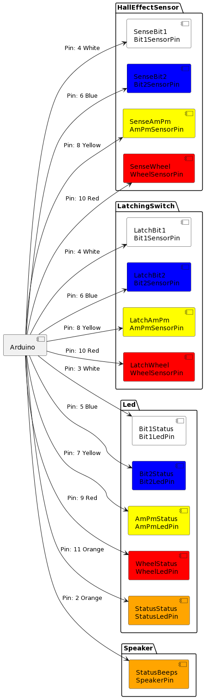

[Full Readme](README.md)

### Pin Configuration

- **Speaker Pin (Pin 2)**: Utilized for status beep notifications, indicating reminders or alerts. Connected to a digital output pin on the Arduino.

#### LED Pins:
- **Bit1 Status LED (Pin 3)**: White LED for indicating Bit1 status.
- **Bit2 Status LED (Pin 5)**: Blue LED for indicating Bit2 status.
- **AM/PM Status LED (Pin 7)**: Yellow LED for differentiating between AM and PM doses.
- **Wheel Status LED (Pin 9)**: Red LED for showing the wheel's (pillbox) current position.
- **Status LED (Pin 11)**: Orange LED for general status indications.

#### Hall Effect Sensor Pins:
- **Bit1 Sensor (Pin 4)**: For sensing the position related to Bit1, utilizing two Hall effect sensors.
- **Bit2 Sensor (Pin 6)**: For sensing the position related to Bit2, also with two Hall effect sensors.
- **AM/PM Sensor (Pin 8)**: To determine the AM/PM slot, using two Hall effect sensors.
- **Wheel Sensor (Pin 10)**: For detecting the wheel's position, equipped with two Hall effect sensors.

### Wheel Details

The **Wheel Configurations** section provides detailed insights into how the Physical-Med-Reminder system organizes and identifies each compartment or "slice" of its two pillboxes, referred to as wheels. Each wheel is designed to accommodate a week's medication schedule, with unique identifiers for time of day (morning or evening) and specific days of the week. This structure is pivotal for the system's operation, ensuring precise medication dispensing and adherence to the user's schedule.

#### Wheel 1
- **Intended Use**: Covers Monday morning through Thursday morning doses.
- **Configuration**:
  - **Slices**: Each slice is designated for a specific day and either "Day" or "Eve" (evening) medication.
  - **Pill IDs**: Assigned from 1 to 7, correlating with each compartment's intended medication.
  - **Binary Slice ID**: A three-digit binary code unique to each slice, allowing the system to recognize the current compartment via hall effect sensors.

#### Wheel 2
- **Intended Use**: Utilized for Thursday evening through Sunday evening doses.
- **Configuration**:
  - The second wheel picks up where the first one leaves off, continuing with Thursday evening and ending with Sunday evening.
  - Similar to Wheel 1, each slice has a unique Pill ID and a binary code identifier. However, Wheel 2 has a distinguishing feature: a wheel sensor activated (marked as `true`) to differentiate its slices from those of Wheel 1.

